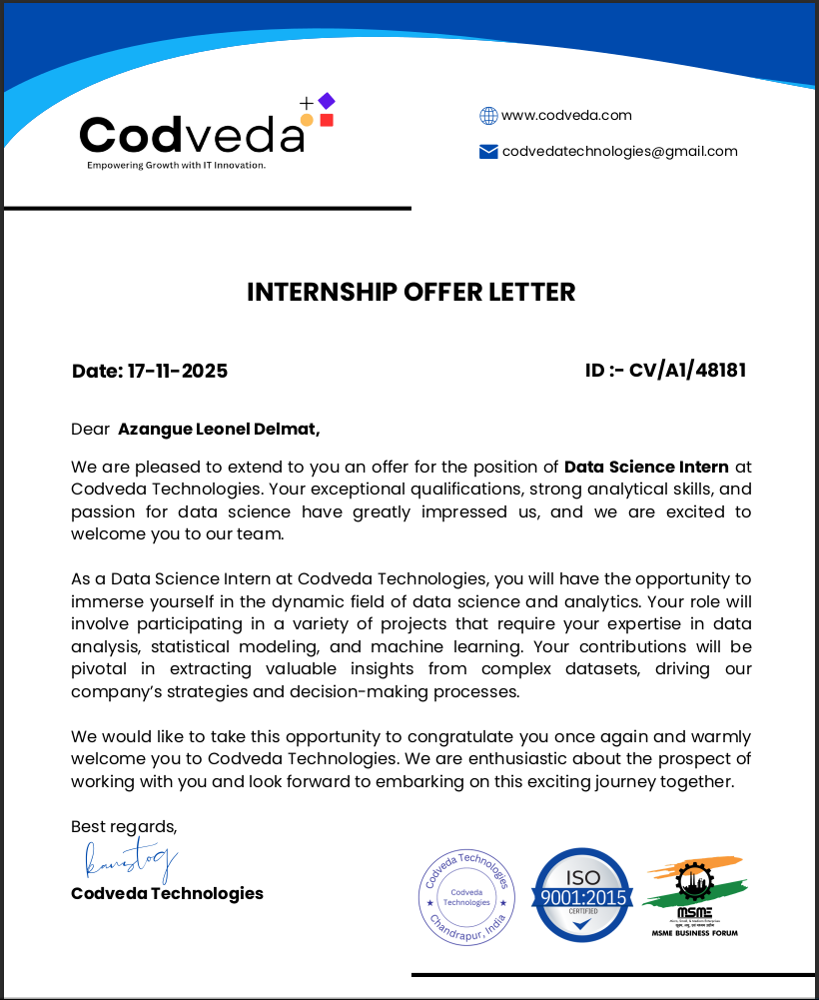
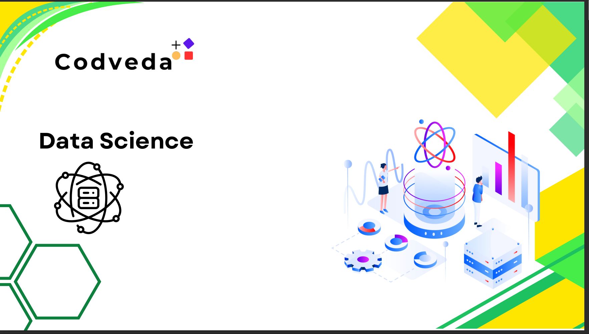
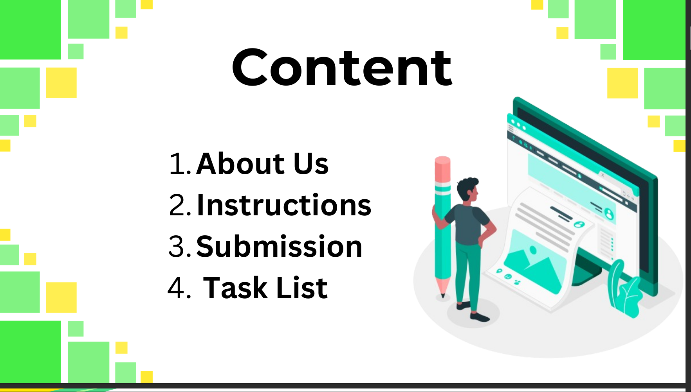

# Codveda Technologies – Data Science Internship  
**Azangue Leonel Delmat** | Novembre 2025  
**ID : CV/A1/48181**  

## Objectif
Réalisation des **9 tâches Data Science** (Basic → Intermediate → Advanced)  
**Une tâche par jour** – Terminé bien avant la deadline du 1er décembre 2025  

## Planning & Branches (Mise à jour quotidienne)

| Jour | Date       | Niveau       | Tâche                                    | Branch                        | Statut     |
|------|------------|--------------|------------------------------------------|-------------------------------|------------|
| 1    | 20/11/2025 | Level 1      | Data Collection & Web Scraping           | `level1-web-scraping`         | ✅ Done    |
| 2    | 21/11/2025 | Level 1      | Data Cleaning & Preprocessing            | `level1-data-cleaning`        | ⏳ Today   |
| 3    | 22/11/2025 | Level 1      | Exploratory Data Analysis (EDA) + Report | `level1-eda`                  |           |
| 4    | 23/11/2025 | Level 2      | Predictive Modeling – Regression         | `level2-regression`           |           |
| 5    | 24/11/2025 | Level 2      | Classification (Logistic + comparaisons) | `level2-classification`       |           |
| 6    | 25/11/2025 | Level 2      | Clustering K-Means + Elbow/Silhouette    | `level2-clustering`           |           |
| 7    | 26/11/2025 | Level 3      | Time Series Analysis & Forecasting       | `level3-time-series`          |           |
| 8    | 27/11/2025 | Level 3      | NLP – Text Classification (Sentiment)   | `level3-nlp-sentiment`        |           |
| 9    | 28/11/2025 | Level 3      | Neural Networks – TensorFlow/Keras       | `level3-neural-network`       |           |

**Repo unique – Tout le portfolio en un seul endroit**  
Tout le code, datasets, notebooks et rapports dans ce repository  
Dossiers : `/data` – `/notebooks`

## Projets réalisés (en cours de construction)
- Web scraping de 1000 livres (books.toscrape.com)  
- Nettoyage complet + EDA approfondie  
- Modèles de régression, classification, clustering  
- Time Series, NLP et Deep Learning (MNIST/Fashion-MNIST)  

## Outils utilisés
Python • Pandas • NumPy • Scikit-learn • Matplotlib • Seaborn • BeautifulSoup • TensorFlow/Keras • NLTK

#CodvedaJourney #CodvedaExperience #FutureWithCodveda  
#CodvedaAchievements #CodvedaProjects  
#DataScience #MachineLearning #Python #Internship  

Repo complet → https://github.com/**TON_USERNAME_GITHUB**/Codveda-DataScience-Internship  

@Codveda